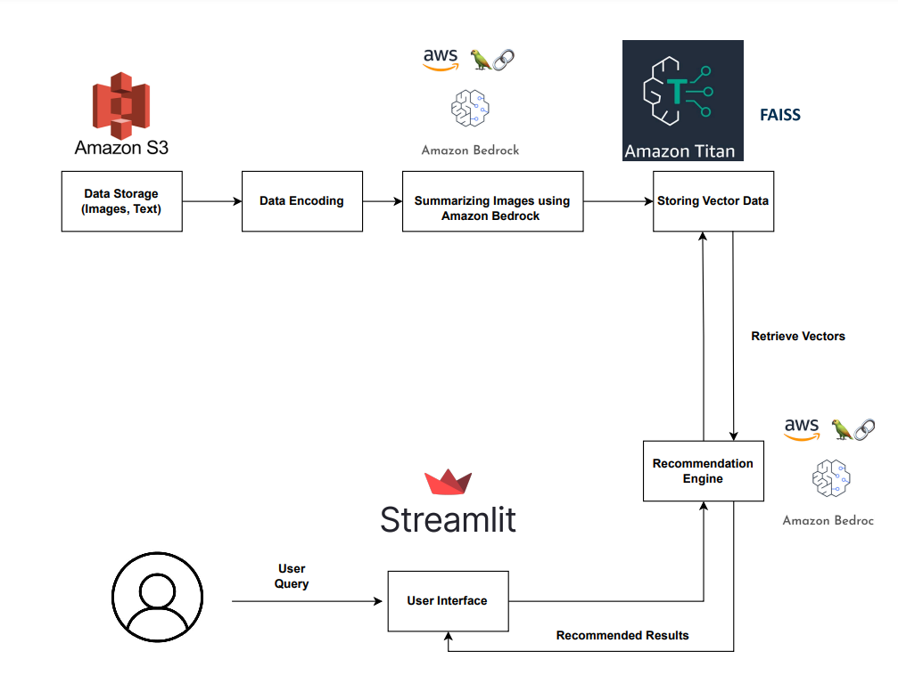
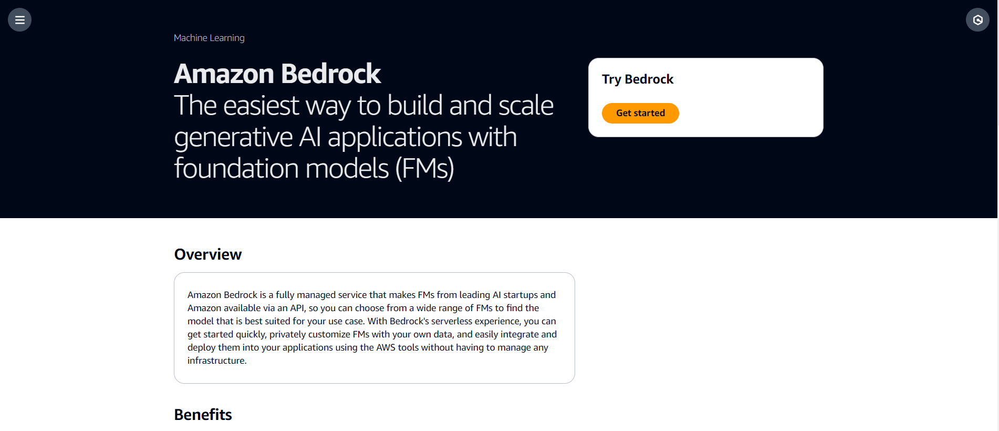
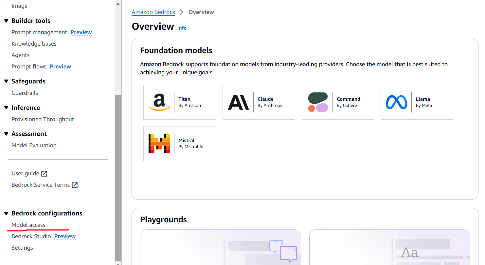

# Multimodal RAG System using AWS Bedrock and FAISS

A **Multimodal Retrieval-Augmented Generation (RAG)** food recommendation assistant for a restaurant-aggregator use case. Users can search by text, upload a dish photo, or combine both; the system retrieves similar menu items from a FAISS vector index and uses **Amazon Bedrock** (Claude Sonnet + Titan embeddings) to rank, summarize, and recommend dishes.

## What this project does

Restaurant aggregators need recommendations that go beyond plain text search. This project:

1. **Ingests multimodal menu data** — CSV metadata plus dish images stored locally (or on S3 in the notebook workflow).
2. **Builds a searchable knowledge base** — Menu descriptions are embedded with **Amazon Titan Text Embeddings v2** and stored in a **FAISS** index for fast similarity search.
3. **Understands images at query time** — Uploaded photos are described by **Claude 3 Sonnet** (multimodal) and merged into the search query.
4. **Generates personalized answers** — A conversational assistant decides whether to ask clarifying questions or return up to three dish recommendations with images, nutrition, price, and ratings via a **Streamlit** chat UI.

Typical flows:

- *"I want something spicy and vegetarian under 500 calories"* → HyDE-style query expansion → FAISS retrieval → JSON-formatted assistant reply → filtered recommendations.
- *Upload a photo of pasta* → Image description → enhanced search → similar dishes with summaries.

## Technologies

| Layer | Technology |
|-------|------------|
| LLM & vision | [Amazon Bedrock](https://aws.amazon.com/bedrock/) — `anthropic.claude-3-sonnet-20240229-v1:0` |
| Embeddings | Amazon Bedrock — `amazon.titan-embed-text-v2:0` |
| Orchestration | [LangChain](https://python.langchain.com/) (`langchain`, `langchain-community`) |
| Vector store | [FAISS](https://github.com/facebookresearch/faiss) (`faiss-cpu`) |
| UI | [Streamlit](https://streamlit.io/) + `streamlit-chat` |
| Data / cloud | `boto3`, `pandas`; optional **Amazon S3** (notebook) |
| Runtime | Python **3.10.x** recommended |

## Solution architecture



### Data ingestion and indexing (offline)

1. **Data storage** — Menu images and text live in **Amazon S3** (notebook) or the local `data/` folder.
2. **Data encoding** — Raw records are prepared for multimodal processing.
3. **Summarizing images** — **Amazon Bedrock** (Claude Sonnet) with **LangChain** generates text descriptions from dish photos.
4. **Storing vector data** — Descriptions are embedded with **Amazon Titan** and indexed in **FAISS** for fast similarity search.

### Query and recommendations (online)

1. **User interface** — The user submits a text query and/or image via a **Streamlit** app.
2. **Recommendation engine** — **Bedrock** + **LangChain** enhance the query, retrieve relevant vectors from FAISS, check relevance, and format responses.
3. **Recommended results** — Matching dishes (name, restaurant, nutrition, price, rating, image) are returned to the UI.

**Offline (notebook):** `multimodal-llm.ipynb` — load data → image summaries → Titan embeddings → `save_local("output/faiss_index")`.

**Online (`app.py`):** load FAISS index → user message (and optional image) → enhance query → similarity search → assistant + relevance checks → display recommendations.

## Project structure

```
.
├── app.py                      # Streamlit food recommendation app
├── utils.py                    # LLM helpers (image describe, HyDE, relevance, etc.)
├── multimodal-llm.ipynb        # End-to-end build: S3/local data → FAISS index
├── requirements.txt
├── data/
│   ├── restaurants_menu_data.csv
│   ├── menu_descriptions_data.csv   # large; used after image summarization
│   └── images/                      # R001–R010 restaurant dish images
├── output/faiss_index/              # Pre-built index (ready for app.py)
└── reference-images/              # Docs screenshots (Bedrock setup, architecture)
```

## Prerequisites

- Python 3.10.x
- AWS account with **Bedrock model access** enabled (see below)
- AWS credentials configured (`aws configure` or environment variables)
- Default Bedrock region with **Claude 3 Sonnet** and **Titan Embed Text v2** (e.g. `us-east-1`)

## Quick start (local)

### 1. Clone and enter the project

```bash
cd "/path/to/Multimodal RAG System using AWS Bedrock and FAISS"
```

### 2. Create a virtual environment and install dependencies

**macOS / Linux:**

```bash
python3.10 -m venv myenv
source myenv/bin/activate
pip install -r requirements.txt
```

**Windows:**

```cmd
py -3.10 -m venv myenv
myenv\Scripts\activate
pip install -r requirements.txt
```

### 3. Configure AWS credentials

```bash
aws configure
```

Provide your Access Key ID, Secret Access Key, and default region (e.g. `us-east-1`).

### 4. Request Bedrock model access

1. Open the [AWS Management Console](https://aws.amazon.com/console) and search for **Bedrock**.
2. Choose **Get started** → **Manage model access**.
3. Enable at least:
   - **Anthropic Claude 3 Sonnet** (multimodal chat)
   - **Amazon Titan Text Embeddings v2**
4. Use a region where both models are available (e.g. **US East (N. Virginia)**).





### 5. Run the app

A pre-built FAISS index is included under `output/faiss_index/`, so you can start the UI without re-running the notebook:

```bash
streamlit run app.py
```

Open the URL shown in the terminal (usually `http://localhost:8501`).

### 6. (Optional) Rebuild the FAISS index

If you change data or embeddings settings, run `multimodal-llm.ipynb` from the project root (after AWS setup). The notebook saves the index to `output/faiss_index/`, which `app.py` loads on startup.

---

## Data setup (S3 — optional)

For the notebook’s S3 workflow:

1. Create an S3 bucket in the [S3 console](https://s3.console.aws.amazon.com/).
2. Upload `data/` (CSVs and `images/`) or your own copies.
3. Update bucket/region/credentials in the notebook cells.

You can also use the bundled `data/` folder locally without S3.

---

## Deploy on EC2 (optional)

1. Launch **Ubuntu 22.04** EC2; open inbound **8501** for Streamlit.
2. SSH in, install Python/pip, copy the project (e.g. `scp -r`).
3. `pip3 install -r requirements.txt`
4. `streamlit run app.py` (or `nohup streamlit run app.py` for a long-running process).

See [ProjectPro EC2 deployment guide](https://www.projectpro.io/project-use-case/build-and-deploy-an-end-to-end-machine-learning-pipeline-for-a-classification-model) for general EC2/Streamlit patterns.

---

## Troubleshooting

| Issue | What to check |
|-------|----------------|
| `AccessDeniedException` on Bedrock | Model access approved in the same region as `aws configure` |
| `FileNotFoundError` for `output/faiss_index` | Run the notebook indexing cells or restore `output/faiss_index/` |
| Image path errors in UI | Run the app from the project root so `data/images/...` resolves |
| Wrong Streamlit command | Use `streamlit run app.py` (not `llm_app.py`) |

## License

Educational / portfolio use. Verify AWS Bedrock and Anthropic terms for your deployment.
